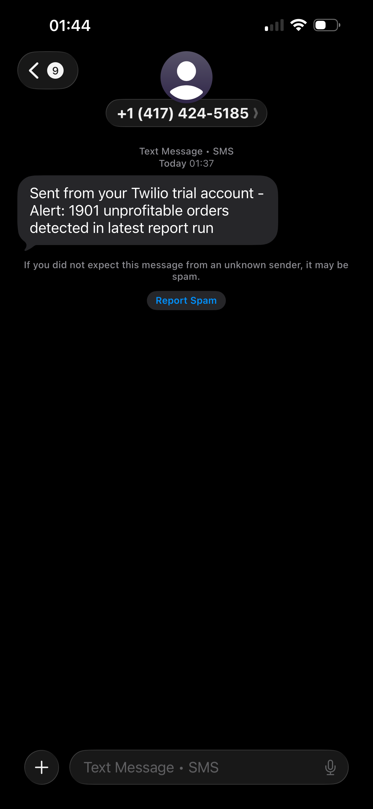

# superstore-reporting-pipeline

Business Operations Automation: A hands-on project simulating internal tooling for real business operations environments. Built using AI-assisted development (Claude Code) following a self-written spec before each feature.

---

## Spec: Unprofitable Orders Alert

- Load the Superstore dataset from the local Excel file
- Identify all orders where profit is negative
- Output a clean summary (Order ID, Customer Name, Product Name, Sales, Profit) into a new Google Sheet tab called "Flagged Orders"
- Send a single SMS via Twilio summarizing how many flagged orders were found (e.g. "Alert: 23 unprofitable orders detected in latest report run")

---

## Progress

### Step 1 — Load and filter unprofitable orders

- Loads `sample_-_superstore.xls` using pandas + xlrd
- Filters rows where Profit < 0
- Selects the 5 columns from the spec: Order ID, Customer Name, Product Name, Sales, Profit
- Sorts by worst profit first and prints the full table

### Step 2 — Google Sheets API integration

- Authenticates via a scoped service account (spreadsheets scope only)
- Writes filtered results into a "Flagged Orders" tab in Google Sheets
- Idempotent — re-running clears and rewrites the tab rather than appending duplicates
- Sends header + data in a single API call to stay within rate limits
- Result: 1,901 unprofitable orders written to the sheet

### Step 3 — Twilio SMS alert

- Authenticates via Twilio REST API using credentials stored in `.env`
- Sends a single SMS on each run: `"Alert: 1901 unprofitable orders detected in latest report run"`
- Credentials loaded with `python-dotenv` — never hardcoded

---

## Setup

### Prerequisites

```
pip install pandas xlrd gspread google-auth twilio python-dotenv
```

### Credentials

**Google Sheets** — create a service account in Google Cloud Console, enable the Sheets API, download the JSON key as `credentials.json`, and share your target sheet with the service account email (Editor access).

**Twilio** — copy your Account SID, Auth Token, and Twilio phone number from [console.twilio.com](https://console.twilio.com).

Create a `.env` file in the project root:

```
TWILIO_ACCOUNT_SID=ACxxxxxxxxxxxxxxxxxxxxxxxxxxxxxxxx
TWILIO_AUTH_TOKEN=your_auth_token_here
TWILIO_FROM=+1xxxxxxxxxx
TWILIO_TO=+1xxxxxxxxxx
```

Both `.env` and `credentials.json` are in `.gitignore` and will not be committed.

### Run

```
python3 flag_orders.py
```

Expected output:

```
Total rows: 10194
Flagged (unprofitable) orders: 1901
Cleared existing "Flagged Orders" tab
Written 1901 rows to Google Sheets.
SMS sent (SID: SMxxxxxxxxxxxxxxxxxxxxxxxxxxxxxxxxxx)
```

---

## Stack

- Python
- pandas + xlrd
- Google Sheets API (gspread + google-auth)
- Twilio

\_\_

## Twilio output


